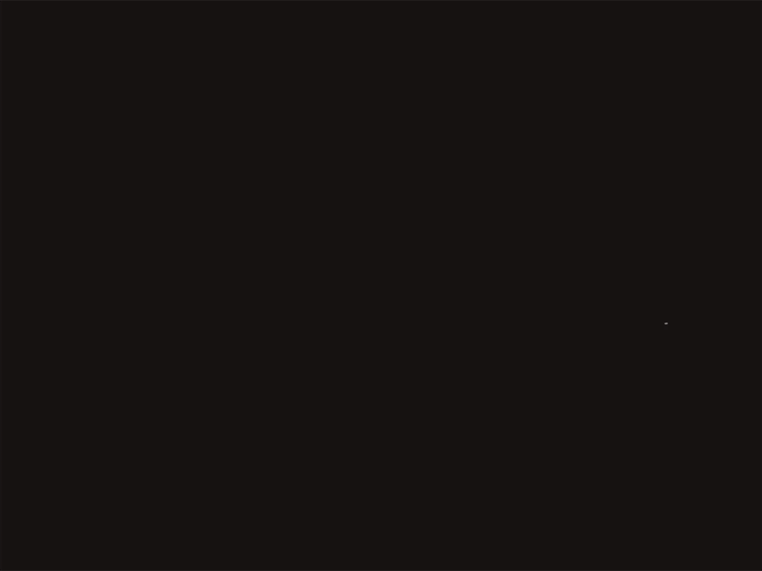
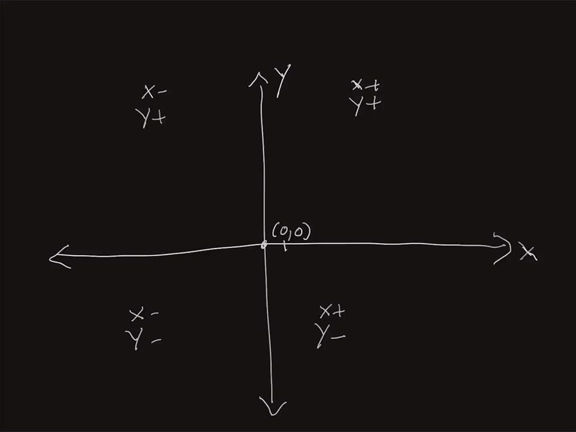
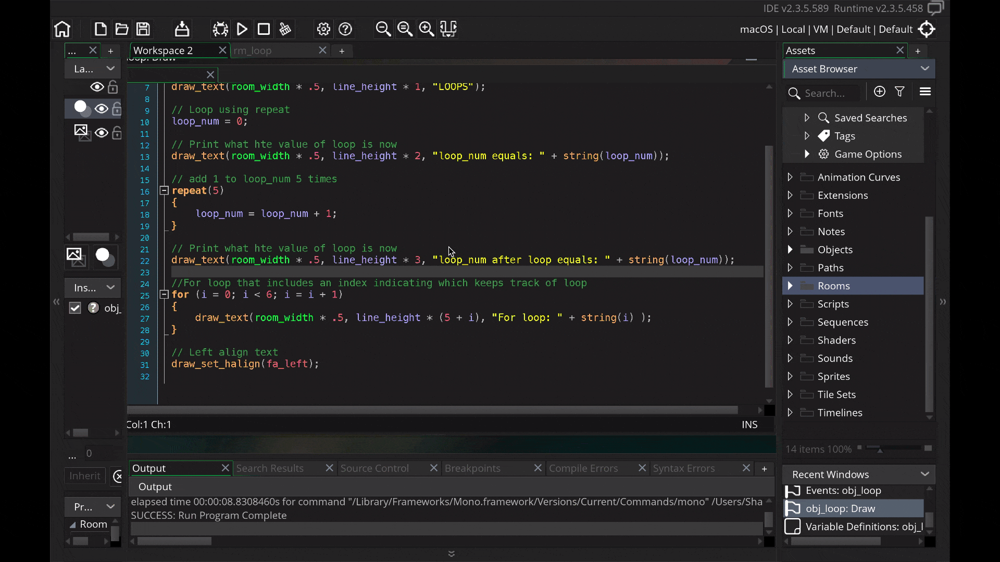

### Screen Positioning I

[home](../README.md#user-content-gms2-screen-positioning) • [next](../)

Lets take a closer look at how we position text, objects and other items on screen.

 

---

##### `Step 1.`\|`MTP`|:small_blue_diamond:

So why does `draw_text(room_width * .5, line_height, "Message");` draw to the screen in the location that it does?  What is `x` and what is `y`?  What does `room_width` represent?

Lets look at this is some detail.  We are positioning objects on the screen using the [cartesian coordinate system](https://en.wikipedia.org/wiki/Cartesian_coordinate_system).

You have most likely seen this in school, it is a two axis representation of an two dimensional area with an x-axis that runs East/West and a y-axis that runs North/South. 
	
The intersection of the two axis is point (0,0).  The X axis is positive towards the right and the Y axis is positive upwards.

##### `Step 2.`\|`FHIU`|:small_blue_diamond: :small_blue_diamond: 

To position points we move along the **X** & **Y** axis.  So for position *(2, -2)* we go two positions to the right on the x axis (away from (0,0)) and two positions down on the y axis.  For point *(-2, 4)* we go two to the left on the x axis and four upwards in y.  So they end up here.

##### `Step 3.`\|`MTP`|:small_blue_diamond: :small_blue_diamond: :small_blue_diamond:

**GameMaker** is slightly different.  First point *(0,0)* is at the top left corner of the room.  **Y** is positive going down and *negative* moving **upwards**. So the quadrant that the room is in is all x-axis positive and y-axis positive.  Moving downscreen is also y positive.  The top right corner of the room is the *(0, room_width)*. The bottom left corner is *(0, room_height)* and the bottom right is *(room_width, room_height)*.  The top center is *(room_width/2, 0)*.  The middle center is *(room_width/2, room_height/2)*.  

##### `Step 4.`\|`MTP`|:small_blue_diamond: :small_blue_diamond: :small_blue_diamond: :small_blue_diamond:

Create a new room called `rm_position_objects` and place it at the top of the **Room Order** list.

##### `Step 5.`\|`MTP`| :small_orange_diamond:

Open the room **rm_position_objects**. We do not use hard coded numbers for the room height and width.  That way we can change the size of the room and our game will still work.  If you go to the room you will see the **Width** and **Height** and these are the same values stored in `room_width` and `room_height`.

##### `Step 6.`\|`MTP`| :small_orange_diamond: :small_blue_diamond:

Right click on **Objects** and select **Create | Object** called `obj_position_objects`. Add a **Draw | Draw** event to draw to screen.

##### `Step 7.`\|`MTP`| :small_orange_diamond: :small_blue_diamond: :small_blue_diamond:

Press the <kbd>Variable Definitions</kbd> button and then press the <kbd>Add</kbd> button.  **Name** the variable `line_height` and set the **Default** to `22`.  Change the **Type** to `integer`.

##### `Step 8.`\|`MTP`| :small_orange_diamond: :small_blue_diamond: :small_blue_diamond: :small_blue_diamond:

Now add to the **Draw** script:

* Center align text
* Draw a title in the middle of the screen
* Reset text alignment

##### `Step 9.`\|`MTP`| :small_orange_diamond: :small_blue_diamond: :small_blue_diamond: :small_blue_diamond: :small_blue_diamond:

Add a **obj_object_positions** to **rm_object_positions**.  Now *press* the <kbd>Play</kbd> button in the top menu bar to launch the game. See the title in the center of the screen.

##### `Step 10.`\|`MTP`| :large_blue_diamond:

##### `Step 11.`\|`MTP`| :large_blue_diamond: :small_blue_diamond: 

##### `Step 12.`\|`MTP`| :large_blue_diamond: :small_blue_diamond: :small_blue_diamond: 

##### `Step 13.`\|`MTP`| :large_blue_diamond: :small_blue_diamond: :small_blue_diamond:  :small_blue_diamond: 

##### `Step 14.`\|`MTP`| :large_blue_diamond: :small_blue_diamond: :small_blue_diamond: :small_blue_diamond:  :small_blue_diamond: 

##### `Step 15.`\|`MTP`| :large_blue_diamond: :small_orange_diamond: 

##### `Step 16.`\|`MTP`| :large_blue_diamond: :small_orange_diamond:   :small_blue_diamond: 

##### `Step 17.`\|`MTP`| :large_blue_diamond: :small_orange_diamond: :small_blue_diamond: :small_blue_diamond:

##### `Step 18.`\|`MTP`| :large_blue_diamond: :small_orange_diamond: :small_blue_diamond: :small_blue_diamond: :small_blue_diamond:

##### `Step 19.`\|`MTP`| :large_blue_diamond: :small_orange_diamond: :small_blue_diamond: :small_blue_diamond: :small_blue_diamond: :small_blue_diamond:

##### `Step 20.`\|`MTP`| :large_blue_diamond: :large_blue_diamond:

##### `Step 21.`\|`MTP`| :large_blue_diamond: :large_blue_diamond: :small_blue_diamond:

___

| [home](../README.md#user-content-gms2-screen-positioning) | [next](../)|
|---|---|

